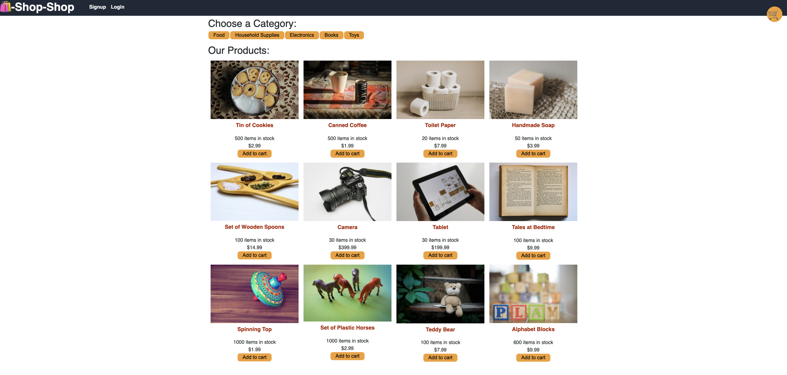

# Redux Store

## Description

The Redux Store app is an e-commerce app is built using the MERN stack. You can easily click products to add them to your cart for checkout. The site uses Stripe to process payments.

## Features

You can use choose a category on the top of the page to narrow down results you see to find a more specific product. For example if you want to shop for specifically Food products, you would just click the Food filter at the top of the page and it would narrow down your choices. 

When you click the Cart icon you will be shown what items you have added to your cart, and the quantities. 

When you select to Checkout, you will be taken to the checkout page powered by Stripe. This is where you can enter your payment information.

GitHub: https://github.com/evancastillo/redux-store

Heroku: https://still-badlands-12317.herokuapp.com/